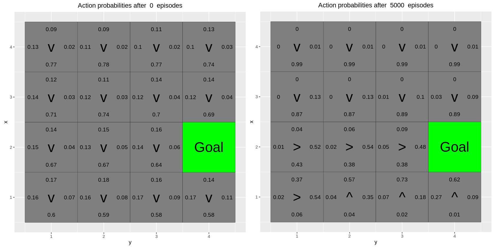

```{r setup, include=FALSE, echo=FALSE}
###########################  Init code For Assignment ##########################
rm(list = ls())
knitr::opts_chunk$set(echo = TRUE)
library(ggplot2)
library(gridExtra)
```

```{r common-code, echo=FALSE}
###########################  Common Codes ######################################
MovingAverage <- function(x, n){
  cx <- c(0,cumsum(x))
  rsum <- (cx[(n+1):length(cx)] - cx[1:(length(cx) - n)]) / n
  return (rsum)
}
```

# Q-Learning

## 1. Function Implementation

The following are the implementations of GreedyPolicy and EpsilonGreedyPolicy function.

```{r q-learning-common, echo=FALSE}
###########################  Code For Q-Learning Implementation ################
# By Jose M. Peña and Joel Oskarsson.
# For teaching purposes.
# jose.m.pena@liu.se.

################################################################################
# Q-learning
################################################################################

# install.packages("ggplot2")
# install.packages("vctrs")
library(ggplot2)

arrows <- c("^", ">", "v", "<")
action_deltas <- list(c(1,0), # up
                      c(0,1), # right
                      c(-1,0), # down
                      c(0,-1)) # left

vis_environment <- function(iterations=0, epsilon = 0.5, alpha = 0.1, 
                            gamma = 0.95, beta = 0){
  
  # Visualize an environment with rewards. 
  # Q-values for all actions are displayed on the edges of each tile.
  # The (greedy) policy for each state is also displayed.
  # 
  # Args:
  # iterations, epsilon, alpha ,gamma, beta (optional): for the figure title.
  # reward_map (global variable):a HxW array containing the reward given at each
  #                              state.
  # q_table (global variable):a HxWx4 array containing Q-values for each 
  #                              state-action pair.
  # H, W (global variables): environment dimensions.
  
  df <- expand.grid(x=1:H,y=1:W)
  
  # calculate Q-values for each action at every position
  # for terminal states,reward states,penalty states, Q-values are NA
  foo <- mapply(function(x,y) ifelse(reward_map[x,y] == 0,
                                     q_table[x,y,1],NA),df$x,df$y)
  df$val1 <- as.vector(round(foo, 2))
  foo <- mapply(function(x,y) ifelse(reward_map[x,y] == 0,
                                     q_table[x,y,2],NA),df$x,df$y)
  df$val2 <- as.vector(round(foo, 2))
  foo <- mapply(function(x,y) ifelse(reward_map[x,y] == 0,
                                     q_table[x,y,3],NA),df$x,df$y)
  df$val3 <- as.vector(round(foo, 2))
  foo <- mapply(function(x,y) ifelse(reward_map[x,y] == 0,
                                     q_table[x,y,4],NA),df$x,df$y)
  df$val4 <- as.vector(round(foo, 2))
  
  # Policy Best Direction or Reward
  foo <- mapply(function(x,y) 
    ifelse(reward_map[x,y] == 0,arrows[GreedyPolicy(x,y)],reward_map[x,y]),df$x,df$y)
  df$val5 <- as.vector(foo)
  
  # Grid Colouring
  # Negative rewards are NA,which are coloured red(according to na.value below)
  foo <- mapply(function(x,y) ifelse(reward_map[x,y] == 0,max(q_table[x,y,]),
                                     ifelse(reward_map[x,y]<0,NA,reward_map[x,y])),df$x,df$y)
  df$val6 <- as.vector(foo)
  
  print(ggplot(df,aes(x = y,y = x)) +
          scale_fill_gradient(low = "white", high = "green", na.value = "red", name = "") +
          geom_tile(aes(fill=val6)) +
          geom_text(aes(label = val1),size = 2,nudge_y = .35,na.rm = TRUE) +
          geom_text(aes(label = val2),size = 2,nudge_x = .35,na.rm = TRUE) +
          geom_text(aes(label = val3),size = 2,nudge_y = -.35,na.rm = TRUE) +
          geom_text(aes(label = val4),size = 2,nudge_x = -.35,na.rm = TRUE) +
          geom_text(aes(label = val5),size = 5) + # arrow or number in centre
          geom_tile(fill = 'transparent', colour = 'black') + 
          ggtitle(paste("Q-table after ",iterations," iterations\n",
                        "(epsilon = ",epsilon,", alpha = ",alpha,",gamma = ",
                         gamma,", beta = ",beta,")")) +
          theme(plot.title = element_text(hjust = 0.5),
                axis.text.x = element_text(size = 5),
                axis.text.y = element_text(size = 5),
                legend.text = element_text(size = 5),) +
          scale_x_continuous(breaks = c(1:W),labels = c(1:W)) +
          scale_y_continuous(breaks = c(1:H),labels = c(1:H)))
}
```

```{r q-learning-GreedyPolicy, echo=TRUE}
GreedyPolicy <- function(x, y){
  # Get a greedy action for state (x,y) from q_table.
  # Args:
  #   x, y: state coordinates.
  #   q_table (global variable): a HxWx4 array containing Q-values for each state-action pair.
  # 
  # Returns:
  #   An action, i.e. integer in {1,2,3,4}.
  # 
  
  # Find the actions that corresponding to the highest Q-values at the state 
  # and choose one randomly if there are more than one suitable actions.
  actions <- which(q_table[x,y,] == max(q_table[x,y,]))
  
  # must check like this, directly sample(actions, size = 1) will have error
  if(length(actions) > 1){
    return(sample(actions, size = 1))
  }
  return (actions)
}
```
```{r q-learning-EpsilonGreedyPolicy, echo=TRUE}
EpsilonGreedyPolicy <- function(x, y, epsilon){
  # Get an epsilon-greedy action for state (x,y) from q_table.
  #
  # Args:
  #   x, y: state coordinates.
  #   epsilon: probability of acting randomly.
  # 
  # Returns:
  #   An action, i.e. integer in {1,2,3,4}.
  
  # if random number < epsilon then do random action
  if (runif(1) < epsilon)
    return (sample(1:4, size = 1))
  else
    return (GreedyPolicy(x, y))
}
```

```{r q-learning-transition_model, echo=FALSE}
transition_model <- function(x, y, action, beta){
  # Computes the new state after given action is taken. The agent will follow the action 
  # with probability (1-beta) and slip to the right or left with probability beta/2 each.
  # 
  # Args:
  #   x, y: state coordinates.
  #   action: which action the agent takes (in {1,2,3,4}).
  #   beta: probability of the agent slipping to the side when trying to move.
  #   H, W (global variables): environment dimensions.
  # 
  # Returns:
  #   The new state after the action has been taken.
  
  delta <- sample(-1:1, size = 1, prob = c(0.5*beta, 1-beta, 0.5*beta))
  
  # sample:
  # action = up(1),delta = turn left(-1) => left(4)  
  # action = right(2),delta = turn left(-1) => up(1)
  final_action <- ((action + delta + 3) %% 4) + 1
  
  # get new position
  foo <- c(x,y) + unlist(action_deltas[final_action])
  
  # make sure the new position is within the environment
  foo <- pmax(c(1,1),pmin(foo,c(H,W)))
  return (foo)
}
```

The following is the implementation of q_learning function.

```{r q-learning-function, echo=TRUE}
q_learning <- function(start_state, epsilon = 0.5, alpha = 0.1, gamma = 0.95, 
                       beta = 0){
  
  # Perform one episode of Q-learning. The agent should move around in the 
  # environment using the given transition model and update the Q-table.
  # The episode ends when the agent reaches a terminal state.
  # 
  # Args:
  #   start_state: array with two entries, describing the starting position of the agent.
  #   epsilon (optional): probability of acting randomly.
  #   alpha (optional): learning rate.
  #   gamma (optional): discount factor.
  #   beta (optional): slipping factor.
  #   reward_map (global variable): a HxW array containing the reward given at each state.
  #   q_table (global variable): a HxWx4 array containing Q-values for each state-action pair.
  # 
  # Returns:
  #   reward: reward received in the episode.
  #   correction: sum of the temporal difference correction terms over the episode.
  #   q_table (global variable): Recall that R passes arguments by value. So, q_table being
  #   a global variable can be modified with the superassigment operator <<-.
  
  # init current position
  current_position <- start_state
  episode_correction <- 0

  repeat{
    # Follow policy, execute action, get reward.
    # choose A from S using policy derived from Q (e.g., epsilon-greedy)
    action <- EpsilonGreedyPolicy(current_position[1], current_position[2], epsilon)
    # get new position
    new_position <- transition_model(current_position[1], current_position[2], action, beta)
    # get new reward
    reward <- reward_map[new_position[1], new_position[2]]
    # get current Q-value
    Q <- q_table[current_position[1], current_position[2], action]
    
    # update formula:Page 13 of RL_L1_QLearning.pdf
    # q_{*}(s,a) <- q_{*}(s,a) + alpha * (r + gamma * max_{a'} q_{*}(s',a') - q_{*}(s,a))
    correction_term <- reward + gamma * max(q_table[new_position[1], 
                                            new_position[2],]) - Q
    
    # accumulates the sum of all difference correction terms to to plot later
    # it can be removed if not needed
    episode_correction <- episode_correction + correction_term
    
    # Q-table update.
    q_table[current_position[1], current_position[2], action] <<- Q + alpha * correction_term
    
    current_position <- new_position
    
    if(reward!=0)
      # End episode.
      return (c(reward,episode_correction))
  }
}
```

## 2. Environment A (learning)

### Question

- What has the agent learned after the first 10 episodes ?

- Is the final greedy policy (after 10000 episodes) optimal for all states, i.e. not only for the initial state ? Why / Why not ?

- Do the learned values in the Q-table reflect the fact that there are multiple paths (above and below the negative rewards) to get to the positive reward ? If not, what could be done to make it happen ?

### Answer

In environment A, the start state is (x=3,y=1), parameters are set as epsilon = 0.5 , alpha = 0.1 ,gamma = 0.95 , beta = 0.

After first 10 episodes, the agent has learned the following policies: 

- We found that some of the blocks near red negative blocks began to show negative q-value, this means the agent has already learned to avoid the negative states.

- The agent has learned to move to the right to get the positive reward (+10).(Because of the randomness, this phenomena may not show every time when we recompile the Rmd)

After 10000 episodes, we can see that greedy policy is not optimal for all states. The sample states are start state and (5,7) (Those points may change). The reason why this happens is because the discount factor gamma is set to 0.95, which means the agent will place significant value on future rewards when making decisions, rather than just focusing on short-term gains. Since the optimal policy is aimed at maximizing long-term rewards, more iterations may be needed for the Q-values of all states to converge to their optimal values, ensuring that the greedy policy is optimal across all states.

Regarding multiple paths question that the agent learned, the answer is NO. By checking the values and arrows in the Q-table, there is only one clear path to the final state from the start state above the negative reward.

If we want to make the agent find multiple paths, we should set epsilon to a big value, so the agent will have more random actions to explore the new paths. One thing to mention is if we increase the epsilon, the agent may need more iterations to find the optimal paths. 

```{r env-a, echo=FALSE}
###########################  Code For env-a ##############################
# Environment A (learning)
H <- 5
W <- 7

reward_map <- matrix(0, nrow = H, ncol = W)
reward_map[3,6] <- 10
reward_map[2:4,3] <- -1

q_table <- array(0,dim = c(H,W,4))
```

***Init stage***

```{r env-a-init, echo=FALSE}
# init env plot
# epsilon = 0.5, alpha = 0.1, gamma = 0.95, beta = 0 is default value
vis_environment()
```

***Different stages***

```{r env-a-plain, echo=FALSE}
#init plot list
for(i in 1:10000){
  foo <- q_learning(start_state = c(3,1))
  
  if(any(i==c(10,100,1000,10000)))
    vis_environment(i)
}
```

## 3. Environment B (epsilon and gamma)

### Question

This is a 7×8 environment where the top and bottom rows have negative rewards. In this environment, the agent starts each episode in the state (4, 1). There are two positive rewards, of 5 and 10. The reward of 5 is easily reachable, but the agent has to navigate around the first reward in order to find the reward worth 10.

Investigate how the $\epsilon$ and $\gamma$ parameters affect the learned policy by running 30000 episodes of Q-learning with $\epsilon= 0.1, 0.5$, $\gamma = 0.5, 0.75, 0.95$, $\beta = 0$ and $\alpha = 0.1$ and explain observations.

### Answer
In environment B, the start state is (x=4,y=1), and parameters are set as epsilon = 0.1, 0.5, alpha = 0.1, gamma = 0.5, 0.75, 0.95, beta = 0.

Gamma and epsilon have a significant impact on the learned policy.

Comparing the different gamma values, and all other parameters fixed, we can find that when gamma is very high(0.95), reward 5 will be ignored, and the agent prefers reward 10.

When gamma is small(0.5), the agent will have some chances to choose reward 5 and then stop, but it has more chance to choose reward 10. The reason is that when gamma gets very high, the agent will place significant value on future rewards when making decisions, the future reward in this case is reward 10 instead of reward 5. If gamma is small, the agent will focus more on short-term gains, so it will choose reward 5 first.

This can be seen from the Moving Average plot(gamma = 0.95 and epsilon = 0.5) vs (gamma = 0.5 and epsilon = 0.5). 
When gamma is 0.5, the average reward keep at a similar level, but when gamma is 0.95 when the episode increases to 25000, the agent finds a new high reward path, and then the average reward afterwards increases to a new higher level, and the correction plot also reflect this situation, which means the q-table change a lot in 
this time.
 
Comparing the different epsilon values(0.5 and 0.1)'s q-table, the high epsilon q-table has been highly explored, while the low-value epsilon q-table has been less explored. The reason behind this is that epsilon is the probability of acting randomly, when epsilon is high, the agent will have more chance to choose random actions, which means it has more chance to explore new paths. When the epsilon is small, the agent will have more chance to choose greedy policy rather than random actions, so it will prefer the existing optimized path.

```{r env-b, echo=FALSE}
###########################  Code For env-b ##############################
H <- 7
W <- 8

reward_map <- matrix(0, nrow = H, ncol = W)
reward_map[1,] <- -1
reward_map[7,] <- -1
reward_map[4,5] <- 5
reward_map[4,8] <- 10

q_table <- array(0,dim = c(H,W,4))
```

***Init stage***

```{r env-b-init, echo=FALSE}
# init env plot
vis_environment()
```

***Different gamma for epsilon = 0.5***

```{r env-b-different-eps-gamma-1, echo=FALSE}
# default epsilon = 0.5
for(j in c(0.5,0.75,0.95)){
  q_table <- array(0,dim = c(H,W,4))
  reward <- NULL
  correction <- NULL
  
  for(i in 1:30000){
    foo <- q_learning(gamma = j, start_state = c(4,1))
    reward <- c(reward,foo[1])
    correction <- c(correction,foo[2])
  }
  vis_environment(i, gamma = j)
  par(mfrow = c(1,2))
  plot(MovingAverage(reward,100),type = "l")
  plot(MovingAverage(correction,100),type = "l")
  par(mfrow = c(1,1))
}
```

***Different gamma for epsilon = 0.1***

```{r env-b-different-eps-gamma-2, echo=FALSE}
# change epsilon to 0.1
for(j in c(0.5,0.75,0.95)){
  q_table <- array(0,dim = c(H,W,4))
  reward <- NULL
  correction <- NULL
  
  for(i in 1:30000){
    foo <- q_learning(epsilon = 0.1, gamma = j, start_state = c(4,1))
    reward <- c(reward,foo[1])
    correction <- c(correction,foo[2])
  }
  
  vis_environment(i, epsilon = 0.1, gamma = j)
  par(mfrow = c(1,2))
  plot(MovingAverage(reward,100),type = "l")
  plot(MovingAverage(correction,100),type = "l")
  par(mfrow = c(1,1))
}
```

## 4. Environment C (beta)

### Question

This is a smaller 3 x 6 environment. Here the agent starts each episode in the state (1,1). 
Your task is to investigate how the $\beta$ parameter affects the learned policy by
running 10000 episodes of Q-learning with $\beta = 0, 0.2, 0.4, 0.66$, $\epsilon = 0.5$, $\gamma = 0.6$ and $\alpha = 0.1$.

In environment C, the start state is (x=1,y=1).

### Answer

From the plots below, we can get the conclusion that beta (0, 0.2, 0.4, 0.66), did not show a significant impact on the learned policy. 

when beta increases, the agent has more chance to slip to the side, however, in our case, our world is small, and it is easy for the agent to find the optimal path to the target state, randomly turning left and turning right will help to find the optimal path, So the agent will not greatly be affected by the beta value.

Meanwhile, gamma is 0.6, which is not very high, and the agent will not focus on the long-term reward, so the agent will not explore more paths to the target state which results in several not fully explored states in the q-table.

```{r env-c, echo=FALSE,eval=FALSE}
###########################  Code For env-c ##############################
H <- 3
W <- 6

reward_map <- matrix(0, nrow = H, ncol = W)
reward_map[1,2:5] <- -1
reward_map[1,6] <- 10
```

***Init stage***

```{r env-c-init, echo=FALSE}
q_table <- array(0,dim = c(H,W,4))
vis_environment()
```

***Different beta***

```{r env-c-different-beta, echo=FALSE}
# different beta = 0, 0.2, 0.4, 0.66
for(j in c(0,0.2,0.4,0.66)){
  # init q_table to 0
  q_table <- array(0,dim = c(H,W,4))
  for(i in 1:10000)
    foo <- q_learning(gamma = 0.6, beta = j, start_state = c(1,1))
  vis_environment(i, gamma = 0.6, beta = j)
}
```

# Reinforce

The file RL Lab2 Colab.ipynb in the course website contains an implementation of the REINFORCE algorithm. The file also contains the result of running the code,so that you do not have to run it. So, you do not need to run it if you do not want. Your task is to study the code and the results obtained, and answer some questions.

We will work with a 4 × 4 grid. We want the agent to learn to navigate to a random goalposition in the grid. The agent will start in a random position and it will be told the goal position.

The agent receives a reward of 5 when it reaches the goal. Since the goal position can be any position, we need a way to tell the agent where the goal is. Since our agent does not have any memory mechanism, we provide the goal coordinates as part of the state at every time step, i.e. a state consists now of four coordinates: Two for the position of the agent, and two for the goal position. The actions of the agent can however only impact its own position, i.e. the actions do not modify the goal position. Note that the agent initially does not know that the last two coordinates of a state indicate the position with maximal reward, i.e. the goal position. It has to learn it. It also has to learn a policy to reach the goal position from the initial position. Moreover, the policy has to depend on the goal position, because it is chosen at random in each episode. Since we only have a single non-zero reward, we do not specify a reward map. Instead, the goal coordinates are passed to the functions that need to access the reward function.

## 5. Environment D

### Question

In this task, we will use eight goal positions for training and, then, validate the learned policy on the remaining eight possible goal positions. The training and validation goal positions are stored in the lists train goals and val goals in the code in the file RL Lab2 Colab.ipynb. The results provided in the file correspond to running the REINFORCE algorithm for 5000 episodes with $\beta = 0$ and $\gamma = 0.95$. Each training episode uses a
random goal position from train goals. The initial position for the episode is also chosen
at random. When training is completed, the code validates the learned policy for the goal positions in val goals. This is done by with the help of the function vis prob, which shows the grid, goal position and learned policy. Note that each non-terminal tile has four values.
These represent the action probabilities associated to the tile (state). Note also that each non-terminal tile has an arrow. This indicates the action with the largest probability for the tile (ties are broken at random). Finally, answer the following questions:

- 1. Has the agent learned a good policy? Why / Why not ?
- 2. Could you have used the Q-learning algorithm to solve this task ?

### Answer

The plots screen shots as below.

```{r, echo=FALSE,out.height="25%"}

```
```{r, echo=FALSE,out.height="25%"}

```
```{r, echo=FALSE,out.height="25%"}

```
```{r, echo=FALSE,out.height="25%"}

```
```{r, echo=FALSE,out.height="25%"}

```
```{r, echo=FALSE,out.height="25%"}

```
```{r, echo=FALSE,out.height="25%"}

```
```{r, echo=FALSE,out.height="25%"}

```

According to the plots provided, and compare the result of val_goals(which is real location of reward) and the result of RF given the init position(train_goals), after checking all the arrows, we can say that the agent has learned a good policy(for almost all the states). 

We also notice that the agent find the optimal path by minimize the categorical_crossentropy and using sgd as optimizer.

Q-Learning is not suitable to solve this dynamic problem. Q-Learning is a model-free method ,and it is more suitable to  handle small state space, with not so sparse rewards, and the goal position is known in advance.

In our case, since there is only one known reward in the environment, which means it is a sparse reward matrix, the agent has to rely on exploration to find the goal, when the dimension of the grid increases, the agent needs more steps to find the goal position. when dimension increases, q-learning needs more episodes to find the goal position, meanwhile, we also need to have all goal positions in our training data. However, we only have a tiny 4x4 grid, so it's ok to use q-learning in our case, but it is inefficient. 

Another problem is start position is not fixed(sampled 5000 times), in this dynamic environment, Q-learning doesn’t training well in 
every state, to get a good performance, we may need more episodes to train the agent, which is not practical.

So use function approximation method like DQN(Deep Q-Networks) is more suitable for this kind of tasks.


## 6. Environment E

### Question

In this task, the goals for training are all from the top row of the grid.
The validation goals are three positions from the rows below. To solve this task, simply study
the code and results provided in the file RL Lab2 Colab.ipynb and answer the following questions:

- 1. Has the agent learned a good policy? Why / Why not ?
- 2. If the results obtained for environments D and E differ, explain why.

### Answer

The plots screen shots as below.

```{r, echo=FALSE,out.height="25%"}

```

```{r, echo=FALSE,out.height="25%"}

```

```{r, echo=FALSE,out.height="25%"}

```

From the result, we found that the agent did not learned a good policy.

The reason behind this is that agent only trained with the goal position from the top row, so the agent only learned to find the goal position from very limited states.
while the validation goals are all from the bottom row, so the agent did not learn to find a good policy.

On the other hand, the policy learned in environment D is better, since it trains with different start points, and different goal points across the grid, so the agent learned to find the goal position from different states, which is more general.


\newpage

# Appendix: All code for this report

```{r ref.label=knitr::all_labels(), echo=TRUE, eval=FALSE}
```
