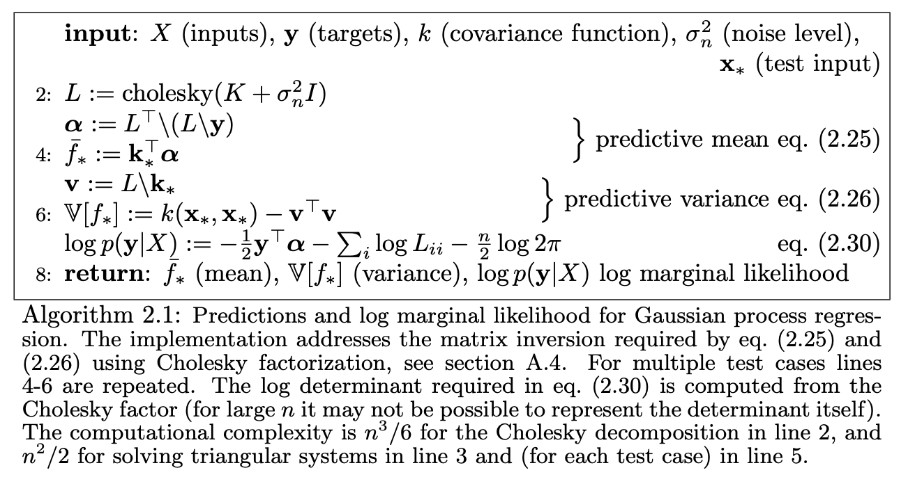

```{r setup, include=FALSE, echo=FALSE}
###########################  Init code For Assignment ##########################
rm(list = ls())
knitr::opts_chunk$set(echo = TRUE)
library(ggplot2)
library(dplyr)
library(tidyr)
library(kernlab)
library(AtmRay)
```

# 1. Implementing GP Regression

This first exercise will have you writing your own code for the Gaussian process regression model:

$$
y=f(x) + \epsilon \text{ where } \epsilon \sim N(0, \sigma^2) \text{ and } f(x) \sim GP(0,k(x,x'))
$$
You must implement Algorithm 2.1 on page 19 of Rasmussen and Willams’ book. listed below.



The algorithm uses the Cholesky decomposition (chol in R) to attain numerical stability. Note that L in the algorithm is a lower triangular matrix, whereas the R function returns an upper triangular matrix. So, you need to transpose the output of the R function. In the algorithm, the notation A/b means the vector x that solves the equation Ax = b (see p. xvii in the book). This is implemented in R with the help of the function solve.

## 1.1 

### Question

Write your own code for simulating from the posterior distribution of f using the squared exponential kernel. The function (name it posteriorGP) should return a vector with the posterior mean and variance of f, both evaluated at a set of x-values ($X_*$). You can assume that the prior mean of f is zero for all x. The function should have the following inputs:

- X: Vector of training inputs.

- y: Vector of training targets/outputs.

- XStar: Vector of inputs where the posterior distribution is evaluated, i.e. $X_{*}$.

- sigmaNoise: Noise standard deviation $\sigma_n$.

- k: Covariance function or kernel. That is, the kernel should be a separate function (see the file GaussianProcesses.R on the course web page).

### Answer

The implementation of the posteriorGP and SquaredExpKernel functions are as follows. 

```{r 1.1,echo=TRUE}
###########################  Code For Assignment 1.1. ##########################
# Define the squared exponential kernel
# We use the code provided in the course material
SquaredExpKernel <- function(x1,x2,sigmaf=1,l=1){
  n1 <- length(x1)
  n2 <- length(x2)
  K <- matrix(NA,n1,n2)
  for (i in 1:n2){
    K[,i] <- sigmaf^2*exp(-0.5*( (x1-x2[i])/l)^2 )
  }
  return(K)
}

posteriorGP <- function(X, y, XStar, sigmaNoise, k, ...){
  # Input:
  # X: Vector of training inputs.
  # y: Vector of training targets/outputs
  # XStar: Vector of inputs where the posterior distribution is evaluated ie X_*
  # sigmaNoise: Noise standard deviation sigma_n
  # k: Covariance function or kernel
  # ...: other parameters for Covariance function k
  
  # used in logp(y|X)
  n <- length(y)
  
  # calculate k(x,x), k(x,x*) and k(x*,x*)
  K_X_X <- k(X, X, ...)
  K_X_XStar <- k(X, XStar, ...)
  K_XStar_XStar <- k(XStar, XStar, ...)
  
  # step 2
  # compute the Cholesky decomposition, transpose the output because 
  # R returns an upper triangular matrix, but we need lower triangular matrix
  L <- t(chol(K_X_X + sigmaNoise^2 * diag(length(X))))
  
  # compute alpha 
  alpha <- solve(t(L), solve(L, y))
  
  # step 4
  # computer f_*
  fStar <- t(K_X_XStar) %*% alpha
  
  # compute v
  v <- solve(L, K_X_XStar)

  # step 6
  # compute variances of f_star
  fstar_var <- K_XStar_XStar - t(v) %*% v
  
  log_p <- -0.5 * t(y) %*% alpha - sum(log(diag(L))) - n/2 * log(2 * pi)
  
  # return the mean, variances and log_p
  return(list(mean = fStar, variances = fstar_var, log_p = log_p))
}
```

## 1.2

### Question

Now, let the prior hyperparameters be $\sigma_f = 1 \text{ and } l = 0.3$.
Update this prior with a single observation: (x, y) = (0.4, 0.719). Assume that $\sigma_n = 0.1$. Plot the posterior mean of f over the interval $x \in [-1, 1]$. Plot also 95% probability (pointwise) bands for f .

### Answer

The posterior mean of f and corresponding 95% probability band plot as follows.

```{r 1.2,echo=TRUE,warning=FALSE}
###########################  Code For Assignment 1.2. ##########################
# define (x, y) = (0.4, 0.719)
# X and y should be vectors,according to the def of the posteriorGP function
observation_1 <- tibble("X"=c(0.4), "y"=c(0.719))

# define sigma_n(value from question)
sigma_n <- 0.1

# Vector of inputs where the posterior distribution is evaluated
x_star <- seq(-1,1,0.01)

# calculate the posterior
posterior <- posteriorGP(observation_1$X, observation_1$y, 
                         x_star, sigma_n, SquaredExpKernel,
                         sigmaf = 1,l = 0.3)

# get the mean , variances and sd
post_mean <- posterior$mean
post_var <- posterior$variances
post_sd <- sqrt(posterior$variances)

# get band for 95% confidence interval
lower_bound <- post_mean - 1.96 * diag(post_sd)
upper_bound <- post_mean + 1.96 * diag(post_sd)
```

```{r 1.2_plot,echo=FALSE}
# plot the posterior mean and 95% confidence interval
ggplot() +
  geom_line(aes(x = x_star, y=post_mean)) +
  geom_line(aes(x = x_star, y = lower_bound), linetype = "dashed", color="red")+
  geom_line(aes(x = x_star, y = upper_bound), linetype = "dashed", color="red")+
  geom_point(aes(x = observation_1$X, y = observation_1$y), color = "red") +
  labs(title = "Post mean and 95% CI with 1 observation(sigmaf = 1, l = 0.3,sigman = 0.1)",
       x = "x",
       y = "f(x)") + 
  theme(plot.title = element_text(hjust = 0.5))
```

## 1.3

### Question

Update your posterior from (2) with another observation: (x,y) = (-0.6,-0.044). Plot the posterior mean of f over the interval $x \in [-1, 1]$. Plot also 95 % probability (point-wise) bands for f.
***Hint***: Updating the posterior after one observation with a new observation gives the same result as updating the prior directly with the two observations.

### Answer

The posterior mean of f and corresponding 95% probability band plot as follows. The 
code is almost same as 1.2, check appendix for the related code.

```{r 1.3,echo=FALSE,warning=FALSE}
###########################  Code For Assignment 1.3. ##########################
# or data.frame(x=c(0.4, -0.6),y=c(0.719, -0.044))
observation_2 <- tibble("X"=c(-0.6), "y"=c(-0.044))
combined_obs <- rbind(observation_1,observation_2)
# almost same code below as 1.2
# define sigma_n
sigma_n <- 0.1

# Vector of inputs where the posterior distribution is evaluated
x_star <- seq(-1,1,0.01)

# calculate the posterior
posterior <- posteriorGP(combined_obs$X, combined_obs$y, 
                         x_star, sigma_n, SquaredExpKernel,
                         sigmaf = 1,l = 0.3)

# get the mean , variances and sd
post_mean <- posterior$mean
post_var <- posterior$variances
post_sd <- sqrt(posterior$variances)

# get band for 95% confidence interval
lower_bound <- post_mean - 1.96 * diag(post_sd)
upper_bound <- post_mean + 1.96 * diag(post_sd)
```

```{r 1.3_plot,echo=FALSE}
# plot the posterior mean and 95% confidence interval
# plot the posterior mean and 95% confidence interval
ggplot() +
  geom_line(aes(x = x_star, y=post_mean)) +
  geom_line(aes(x = x_star, y = lower_bound), linetype = "dashed", color="red")+
  geom_line(aes(x = x_star, y = upper_bound), linetype = "dashed", color="red")+
  geom_point(aes(x = combined_obs$X, y = combined_obs$y), color = "red") +
  labs(title = "Post mean and 95% CI with 2 observations(sigmaf = 1, l = 0.3,sigman = 0.1)",
       x = "x",
       y = "f(x)") + 
  theme(plot.title = element_text(hjust = 0.5))
```

## 1.4

### Question

Compute the posterior distribution of f using all the five data points in the table below (note that the two previous observations are included in the table). Plot the posterior mean of f over the interval $x\in [-1, 1]$. Plot also 95% probability (pointwise) bands for f.

|x  | -1.0  | -0.6   | -0.2   | 0.4   | 0.8    |
|---|---    |---     |---     |---    |---     |
|y  | 0.768 | -0.044 | -0.940 | 0.719 | -0.664 |

### Answer

The posterior mean of f and corresponding 95% probability band plot as follows. The 
code is almost same as 1.2, check appendix for the related code.

```{r 1.4,echo=FALSE,warning=FALSE}
###########################  Code For Assignment 1.4. ##########################
observation_1.4 <- tibble("X"=c(-1.0,-0.6,-0.2,0.4,0.8), 
                          "y"=c(0.768,-0.044,-0.940,0.719,-0.664))

# almost same code below as 1.2
# define sigma_n
sigma_n <- 0.1

# Vector of inputs where the posterior distribution is evaluated
x_star <- seq(-1,1,0.01)

# calculate the posterior
posterior <- posteriorGP(observation_1.4$X, observation_1.4$y, 
                         x_star, sigma_n, SquaredExpKernel,
                         sigmaf = 1,l = 0.3)
# get the mean , variances and sd
post_mean <- posterior$mean
post_var <- posterior$variances
post_sd <- sqrt(posterior$variances)

# get band for 95% confidence interval
lower_bound <- post_mean - 1.96 * diag(post_sd)
upper_bound <- post_mean + 1.96 * diag(post_sd)
```

```{r 1.4_plot,echo=FALSE}
# plot the posterior mean and 95% confidence interval
ggplot() +
  geom_line(aes(x = x_star, y=post_mean)) +
  geom_line(aes(x = x_star, y = lower_bound), linetype = "dashed", color="red")+
  geom_line(aes(x = x_star, y = upper_bound), linetype = "dashed", color="red")+
  geom_point(aes(x = observation_1.4$X, y = observation_1.4$y), color = "red") +
  labs(title = "Post mean and 95% CI with 5 observations(sigmaf = 1, l = 0.3,sigman = 0.1)",
       x = "x",
       y = "f(x)") + 
  theme(plot.title = element_text(hjust = 0.5))
```

## 1.5

### Question

Repeat (1.4), this time with hyperparameters $\sigma_f = 1 \text{ and } l = 1$. Compare the results.

### Answer

The new plot with $\sigma_f = 1 \text{ and } l = 1$ as follows.

We found that changing factor L will change the smoothness of the curve 

When the factor L increases, it yield a smoother value and those far away points
are considered more similar. The model will also have a lower variance , we also 
we got a narrower 95% confidence bands.

While the factor L decreases,it will make the curve less smooth, and the model 
will also have a relative high variance, which will make the confidence bands wider 
at some points.

```{r 1.5,echo=FALSE,warning=FALSE}
###########################  Code For Assignment 1.5. ##########################
observation_1.5 <- tibble("X"=c(-1.0,-0.6,-0.2,0.4,0.8), 
                          "y"=c(0.768,-0.044,-0.940,0.719,-0.664))

# almost same code below as 1.2
# define sigma_n
sigma_n <- 0.1

# Vector of inputs where the posterior distribution is evaluated
x_star <- seq(-1,1,0.01)

# calculate the posterior
posterior <- posteriorGP(observation_1.5$X, observation_1.5$y, 
                         x_star, sigma_n, SquaredExpKernel,
                         sigmaf = 1,l = 1)

# get the mean , variances and sd
post_mean <- posterior$mean
post_var <- posterior$variances
post_sd <- sqrt(posterior$variances)

# get band for 95% confidence interval
lower_bound <- post_mean - 1.96 * diag(post_sd)
upper_bound <- post_mean + 1.96 * diag(post_sd)
```

```{r 1.5_plot,echo=FALSE}
# plot the posterior mean and 95% confidence interval
ggplot() +
  geom_line(aes(x = x_star, y=post_mean)) +
  geom_line(aes(x = x_star, y = lower_bound), linetype = "dashed", color="red")+
  geom_line(aes(x = x_star, y = upper_bound), linetype = "dashed", color="red")+
  geom_point(aes(x = observation_1.5$X, y = observation_1.5$y), color = "red") +
  labs(title = "Post mean and 95% CI with 5 observation(sigmaf = 1, l = 1)",
       x = "x",
       y = "f(x)") + 
  theme(plot.title = element_text(hjust = 0.5))
```

# 2. GP Regression with kernlab

In this exercise, you will work with the daily mean temperature in Stockholm (Tullinge) during the period January 1, 2010 - December 31, 2015. We have removed the leap year day February 29, 2012 to make things simpler. 

Create the variable time which records the day number since the start of the dataset (i.e., time= 1, 2, . . ., 365 × 6 = 2190). Also, create the variable day that records the day number since the start of each year (i.e., day= 1, 2, . . ., 365, 1, 2, . . ., 365). Estimating a GP on 2190 observations can take some time on slower computers, so let us subsample the data and use only every fifth observation. This means that your time and day variables are now time= 1, 6, 11, ..., 2186 and day= 1, 6, 11, ..., 361, 1, 6, 11, ..., 361.

## 2.0 Data Preparation

```{r 2.0,echo=TRUE}
###########################  Code For Assignment 2.0. ##########################
# data2 <- read.csv("https://github.com/STIMALiU/AdvMLCourse/raw/master/
# GaussianProcess/Code/TempTullinge.csv", header=TRUE, sep=";")
data2 <- read.csv("TempTullinge.csv", header=TRUE, sep=";")

# create the variable time and day
data2$time <- 1:nrow(data2)
data2$day <- rep(1:365, times = nrow(data2)/365)

# subsample the data, use only every fifth observation
data2_subset <- data2[seq(1, nrow(data2), 5), ]
```

## 2.1 

### Question

Familiarize yourself with the functions gausspr and kernelMatrix in kernlab. Do ?gausspr and read the input arguments and the output. Also, go through the file KernLabDemo.R available on the course website. You will need to understand it. Now, define your own square exponential kernel function (with parameters $l(ell)$ and $\sigma_f$ (sigmaf)), evaluate it in the point x = 1, x' = 2, and use the kernelMatrix function to compute the covariance matrix K(X, X') in the input vectors X = (1, 3, 4)T and $X_* = (2,3,4)^T$ .

### Answer

```{r 2.1,echo=TRUE}
###########################  Code For Assignment 2.1. ##########################
# define the kernel function, we need to set class name to "kernel" 
# to use kernelMatrix function,which is according to the document of kernelMatrix
# logic is same as SquaredExpKernel function in 1.1
# we set sigmaf=1 and ell=1 here.
kernel_function <- function(sigmaf=1, ell=1){
  rval <- function(x, y = NULL) {
    K <- SquaredExpKernel(x,y,sigmaf,ell)
    return(K)
  }
  class(rval) <- "kernel"
  return(rval)
}
square_kernel_2.1 <- kernel_function(sigmaf=1, ell=1)
```

The output of evaluation in the point x = 1, x' = 2 as follows.

```{r 2.1_1,echo=FALSE}
# evaluate the kernel function
square_kernel_2.1(1,2)
```

The covariance matrix K(X, X') for the input vectors X = (1, 3, 4)T and $X_* = (2,3,4)^T$ as follows. We found that there have two 1 in diagonal, this is because we have two same number in 2nd and 3rd elements of X and X*.

```{r 2.1_2,echo=FALSE}
X <- c(1,3,4)
XStar <- c(2,3,4)
kernelMatrix(kernel = square_kernel_2.1, x = X, y = XStar)
```

## 2.2

Consider first the following model:

$$
temp=f(time)+\epsilon \text{ where } \epsilon \sim N(0,\sigma^2) \text{ and } f(x) \sim GP(0,k(time,time'))
$$
### Question

Let $\sigma_n^2$ be the residual variance from a simple quadratic regression fit (using the lm function in R). Estimate the above Gaussian process regression model using the gausspr function with the squared exponential function from (1) with $\sigma_f = 20$ and $l = 100$ (use the option scaled=FALSE in the gausspr function, otherwise these $\sigma_f$ and l values are not suitable). Use the predict function in R to compute the posterior mean at every data point in the training dataset. Make a scatterplot of the data and superimpose the posterior mean of f as a curve (use type="l" in the plot function). Plot also the 95% probability (pointwise) bands for f. Play around with different values on $\sigma_f$ and l (no need to write this in the report though).

### Answer

```{r 2.2,echo=TRUE}
###########################  Code For Assignment 2.2. ##########################
# fit the quadratic regression model
quad_reg_fit <- lm(temp ~ time + I(time^2), data = data2_subset)

# calculate sigma_n from residual variance(which is mentioned in question)
sigma_n = sd(quad_reg_fit$residuals)

# define sigma_f and l (from question)
sigma_f = 20
l = 100
  
# Gaussian Process Fit
# Fit a Gaussian process model using the Squared Exponential kernel 
# with specified hyper parameters
gp_fit <- gausspr(x = data2_subset$time, y = data2_subset$temp, 
                  kernel = kernel_function(sigmaf = sigma_f, ell = l), 
                  scaled = FALSE,variance.model = TRUE, var = sigma_n^2)
meanPred_time <- predict(gp_fit, data2_subset$time)

#create upper and lower bounds for 95% confidence interval
sdeviation <- predict(gp_fit,data2_subset$time, type="sdeviation")
upper_bound <- meanPred_time + 1.96*sdeviation
lower_bound <- meanPred_time - 1.96*sdeviation

conf_matrix_time <- table('true'=data2_subset$temp, 'prediction'=meanPred_time)
acc_time <- sum(diag(conf_matrix_time))/sum(conf_matrix_time)
# get the missed points count outside upper and lower bounds
missed_points_time_count <- sum((data2_subset$temp > upper_bound | data2_subset$temp < lower_bound))

# Calculate the Mean Squared Error (MSE)
mse_time  <- mean((meanPred_time - data2_subset$temp)^2)

```

```{r 2.2_plot,echo=FALSE}
# use plot to plot the data, the posterior mean and the 95% confidence interval
plot (data2_subset$time, data2_subset$temp,col = "black", xlab = "Time", ylab = "Temperature")
lines(data2_subset$time, meanPred_time, col = "red", type = "l")
lines(data2_subset$time, upper_bound, col = "gray",type = "l")
lines(data2_subset$time, lower_bound, col = "gray",type = "l")
legend("bottomright", legend = c("Observation", "meanPred_time",
"upper_bound", "lower_bound "), pch = c(1, NA, NA,NA), lty = c(NA, 1, 1, 1), 
col = c("black", "red","gray", "gray"))
```

## 2.3

### Question

Repeat the previous exercise, but now use Algorithm 2.1 on page 19 of Rasmussen and Willams’ book to compute the posterior mean and variance of f.

### Answer

We set sigma_f = 20,l = 100 and set sigma_n to what we got in 2.2.

```{r 2.3,echo=TRUE,warning=FALSE}
###########################  Code For Assignment 2.3. ##########################
# define sigma_f and l (from question), use the values in 2.2
sigma_f = 20
l = 100
# keep use sigma_n in 2.2
sigma_n = sd(quad_reg_fit$residuals)

#the posterior mean/variance
post_gp <- posteriorGP(data2_subset$time,data2_subset$temp,
                       data2_subset$time,sigma_n,SquaredExpKernel,
                       sigma_f, l)
meanPost = post_gp$mean

post_var = post_gp$variances
post_sd <- sqrt(post_gp$variances)

# get band for 95% confidence interval
lower_bound <- meanPost - 1.96 * diag(post_sd)
upper_bound <- meanPost + 1.96 * diag(post_sd)


```

```{r 2.3_plot,echo=FALSE}
plot (data2_subset$time, data2_subset$temp,col = "black", xlab="Time",ylab="Temperature")
lines(data2_subset$time, meanPost,  col = "red",  type = "l")

lines(data2_subset$time, upper_bound, col = "gray",type = "l")
lines(data2_subset$time, lower_bound, col = "gray",type = "l")
legend("bottomright", legend = c("Observation", "Mean Post",
"upper_bound", "lower_bound "), pch = c(1, NA, NA,NA), lty = c(NA, 1, 1, 1), 
col = c("black", "red","gray", "gray"))
```

## 2.4

### Question

Consider now the following model:

$$
temp=f(day)+\epsilon \text{ where } \epsilon \sim N(0,\sigma^2) \text{ and } f(x) \sim GP(0,k(day,day'))
$$
Estimate the model using the gausspr function with the squared exponential function
from (1) with $\sigma_f=20$ and $l=100$ (use the option scaled=FALSE in the gausspr
function, otherwise these $\sigma_f$ and l values are not suitable). Superimpose the posterior
mean from this model on the posterior mean from the model in (2). Note that this plot
should also have the time variable on the horizontal axis. Compare the results of both
models. What are the pros and cons of each model?

### Answer

Please check the plot as follows.

Compare the time model in 2.2 and the day model in 2.4, we can find that:

The day model uses a set of data points(same day in different years) to predict the temperature of that day. 
The pros of this model is that it can predict the temperature of a specific day in one year(new data),
but the cons of this model is that it can not catch the trend of the temperature change over time.

While the time model uses continuous feature serial(one feature) data to predict the mean temperature. 
The pros of this model are that it can catch the trend of the temperature change over time. The cons of this 
model are also because of this one feature serials data since we we do not have extra features 
to help us predict the temperature well.

```{r 2.4,echo=TRUE}
# define sigma_f and l (from question)
sigma_f = 20
l = 100
# keep use sigma_n in 2.2
sigma_n = sd(quad_reg_fit$residuals)

# copy the code from 2.2 and change the "time" to "day"
gp_fit_day <- gausspr(x = data2_subset$day, y = data2_subset$temp, 
                      kernel = kernel_function(sigmaf = sigma_f, ell = l), 
                      scaled = FALSE,variance.model = TRUE, var = sigma_n^2)
meanPred_day <- predict(gp_fit_day, data2_subset$day)

#create upper and lower bounds for 95% confidence interval
sdeviation <- predict(gp_fit_day,data2_subset$day, type="sdeviation")
upper_bound <- meanPred_day + 1.96*sdeviation
lower_bound <- meanPred_day - 1.96*sdeviation

conf_matrix_day <- table('true'=data2_subset$temp, 'prediction'=meanPred_day)
acc_day <- sum(diag(conf_matrix_day))/sum(conf_matrix_day)
# get the missed points count outside upper and lower bounds
missed_points_day_count <- sum((data2_subset$temp > upper_bound | data2_subset$temp < lower_bound))

# Calculate the Mean Squared Error (MSE)
mse_day  <- mean((meanPred_day - data2_subset$temp)^2)


```

```{r 2.4_plot,echo=FALSE}
# use plot to plot the data, the posterior mean and the 95% confidence interval
plot(data2_subset$time, data2_subset$temp,col = "black", xlab = "Time", ylab = "Temperature")
lines(data2_subset$time, meanPred_day, col = "red", type = "l")
lines(data2_subset$time, meanPred_time, col = "blue", type = "l")
legend("bottomright", legend = c("Observation", "meanPred day","meanPred time"), pch = c(1, NA, NA), lty = c(NA,1, 1), 
col = c("black", "red","blue"))

```

## 2.5

### Question

Finally, implement the following extension of the squared exponential kernel with a periodic kernel (a.k.a. locally periodic kernel):

$$
k(x,x') = \sigma_f exp\{-\frac{2sin^2(\pi|x-x'|)/d}{l_1^2}\}exp\{-\frac{1}{2}\frac{|x-x'|^2}{l_2^2}\}
$$
Note that we have two different length scales in the kernel. Intuitively, $l_1$ controls the
correlation between two days in the same year, and $l_2$ controls the correlation between the same day in different years. Estimate the GP model using the time variable with this kernel and hyperparameters $\sigma_f = 20$, $l_1 = 1$, $l_2 = 100$ and $d = 365$. Use the gausspr function with the option scaled=FALSE, otherwise these $\sigma_f$ , $l_1$ and $l_2$ values are not suitable. Compare the fit to the previous two models (with $\sigma_f = 20$ and $l = 100$). Discuss the results.

### Answer

```{r 2.5,echo=TRUE}
periodic_kernel <- function(sigmaf, l1, l2, d) { 
  # implement the function logic(stated in the question)
  rval <- function(x, y = NULL) {
        abs_val = abs(x - y)
        exp1_val = exp(-(2 * sin(pi * abs_val/d)^2)/l1^2)
        exp2_val = exp(-0.5 * (abs_val^2/l2^2))
        k = sigmaf^2 * exp1_val * exp2_val 
        return(k)
    }
    class(rval) <- "kernel"
    return(rval)
}

sigmaf_val = 20
l1_val = 1
l2_val = 100
d_val = 365

gp_fit_periodic_kernel <- gausspr(data2_subset$time, data2_subset$temp, 
                                  kernel = periodic_kernel(sigmaf = sigmaf_val, 
                                                           l1 = l1_val, 
                                                           l2 = l2_val, 
                                                           d = d_val), 
                                  scaled = FALSE,variance.model = TRUE, 
                                  var = sigma_n^2)

meanPredExtension = predict(gp_fit_periodic_kernel, data2_subset$time)

#create upper and lower bounds for 95% confidence interval
sdeviation <- predict(gp_fit_periodic_kernel,data2_subset$time, type="sdeviation")
upper_bound <- meanPredExtension + 1.96*sdeviation
lower_bound <- meanPredExtension - 1.96*sdeviation

conf_matrix_Extension <- table('true'=data2_subset$temp, 'prediction'=meanPredExtension)
acc_Extension <- sum(diag(conf_matrix_Extension))/sum(conf_matrix_Extension)
# get the missed points count outside upper and lower bounds
missed_points_Extension_count <- sum((data2_subset$temp > upper_bound | data2_subset$temp < lower_bound))

# Calculate the Mean Squared Error (MSE)
mseExtension  <- mean((meanPredExtension - data2_subset$temp)^2)

```

```{r 2.5_plot,echo=FALSE}
plot(data2_subset$time, data2_subset$temp,col = "black",xlab = "Time", ylab = "Temperature") 
lines(data2_subset$time, meanPred_time, col = "red", type = "l")
lines(data2_subset$time, meanPred_day, col = "blue",type = "l")
lines(data2_subset$time, meanPredExtension, col = "green",type = "l")
legend("bottomright", legend = c("Observation","Prediction Time","Prediction Day", "Periodic Kernel"), 
       pch = c(1, NA, NA, NA,NA), lty = c(NA, 1, 1, 1,1), 
col = c("black","red","blue", "green"))
```

All model's result is more or less similar. By comparing the three models, we can find that the Periodic Kernel model seems to be the best.

We also check the MSE of the models listed below. Periodic Kernel gets a relatively lower MSE than the other two models, which matches what we just guessed.

|               | MSE            |
|:-------------:|:--------------:|
|Time           |`r mse_time`    |
|Day            |`r mse_day`     |
|Periodic Kernel|`r mseExtension`|

```{r 2.5_acc,echo=FALSE}

```

# 3. GP Classification with kernlab

Read about banknoteFraud.csv. Choose 1000 observations as training data.

## 3.0 Data Preparation

```{r 3.0,echo=TRUE}
###########################  Code For Q3 Data Preparation ######################
# data3 <- read.csv("https://github.com/STIMALiU/AdvMLCourse/raw/master/
# GaussianProcess/Code/banknoteFraud.csv", header=FALSE, sep=",")
data3 <- read.csv("banknoteFraud.csv", header=FALSE, sep=",")

# set the column names
names(data3) <- c("varWave","skewWave","kurtWave","entropyWave","fraud") 

# convert the fraud column to factor
data3[,5] <- as.factor(data3[,5])

# sample 1000 observations for training(index)
set.seed(111) 
SelectTraining <- sample(1:dim(data3)[1], size = 1000,replace = FALSE)

# get the training and test data using index above
trainingData <- data3[SelectTraining,]
testData <- data3[-SelectTraining,]
```

## 3.1 

### Question

Use the R package kernlab to fit a Gaussian process classification model for fraud on the training data. Use the default kernel and hyperparameters. Start using only the covariates varWave and skewWave in the model. Plot contours of the prediction probabilities over a suitable grid of values for varWave and skewWave. Overlay the training data for fraud = 1 (as blue points) and fraud = 0 (as red points). You can reuse code from the file KernLabDemo.R available on the course website. Compute the confusion matrix for the classifier and its accuracy.

### Answer

```{r 3.1,echo=TRUE,message=FALSE,warning=FALSE}
###########################  Code For Assignment 3.1. ##########################
# Fit a Gaussian process model using default kernel and hyperparameters
# with only the covariates varWave and skewWave
gp_fit_3.1 = gausspr(fraud~varWave + skewWave, trainingData)

# predict the fraud
pred_fraud_3.1 <- predict(gp_fit_3.1, trainingData[, c('varWave', 'skewWave')])

# calculate the confusion matrix
confusion_matrix_3.1 <- table('true'=trainingData$fraud, 'prediction'=pred_fraud_3.1)
accuracy_3.1 <- sum(diag(confusion_matrix_3.1))/sum(confusion_matrix_3.1)
```

```{r 3.1_cm_accuracy,echo=FALSE}
cat('The confusion matrix:', '\n')
confusion_matrix_3.1
cat('The accuracy:', accuracy_3.1)
```

```{r 3.1_contour,echo=TRUE}
# generate grid values
x1 <- seq(min(trainingData$varWave),max(trainingData$varWave),length.out=100)
x2 <- seq(min(trainingData$skewWave),max(trainingData$skewWave),length.out=100)

# create a grid of points
gridPoints <- meshgrid(x1, x2)
gridPoints <- cbind(c(gridPoints$x), c(gridPoints$y))

gridPoints <- data.frame(gridPoints)
names(gridPoints) <- names(trainingData)[1:2]
probPreds <- predict(gp_fit_3.1, gridPoints, type="probabilities")
```

```{r 3.1_contour_plot,echo=FALSE}
# plot the contours of the prediction probabilities
contour(x = x1, y = x2, z = matrix(probPreds[,1],100,byrow = TRUE), 
        nlevel = 20, xlab = "varWave", ylab = "sekwWave", 
        main = 'Prediction Probabilities')
points(x = trainingData$varWave[pred_fraud_3.1 == 0],
       y = trainingData$skewWave[pred_fraud_3.1 == 0], col = "red")
points(x = trainingData$varWave[pred_fraud_3.1 == 1],
       y = trainingData$skewWave[pred_fraud_3.1 == 1], col = "blue")
legend("bottomright", pch = c("o","o"),
       legend = c("Not fraud", "Fraud"), col = c("red","blue"))
```

## 3.2

### Question

Using the estimated model from (1), make predictions for the test set. Compute the accuracy.

### Answer

Accuracy listed in section 3.3

```{r 3.2,echo=TRUE}
###########################  Code For Assignment 3.2. ##########################
# predict the fraud using test data
pred_fraud_3.2 <- predict(gp_fit_3.1, testData[, c('varWave', 'skewWave')])

# calculate the confusion matrix
confusion_matrix_3.2 <- table('true'=testData$fraud, 'prediction'=pred_fraud_3.2)
accuracy_3.2 <- sum(diag(confusion_matrix_3.2))/sum(confusion_matrix_3.2)
```

## 3.3

### Question

Train a model using all four covariates. Make predictions on the test set and compare
the accuracy to the model with only two covariates.

### Answer

```{r 3.3,echo=TRUE,message=FALSE,warning=FALSE}
###########################  Code For Assignment 3.3. ##########################
# training model on all four covariates(5 variables total)
gp_fit_3.3 = gausspr(fraud ~., trainingData)

# predict the fraud using training and test data
pred_fraud_3.3_training <- predict(gp_fit_3.3, trainingData)
pred_fraud_3.3_test <- predict(gp_fit_3.3, testData)

# calculate the confusion matrix and accuracy
confusion_matrix_3.3_training <- table('true'=trainingData$fraud,
                                       'prediction'=pred_fraud_3.3_training)
accuracy_3.3_training <- sum(diag(confusion_matrix_3.3_training))/
  sum(confusion_matrix_3.3_training)

confusion_matrix_3.3_test <- table('true'=testData$fraud, 
                                   'prediction'=pred_fraud_3.3_test)
accuracy_3.3_test <- sum(diag(confusion_matrix_3.3_test))/
  sum(confusion_matrix_3.3_test)

```

We list all the accuracies in the following table.

| Model                             | Accuracy         |
|-------------------------------    |------------------|
| 2 parameters on training data     | `r accuracy_3.1` |
| 2 parameters on test data         | `r accuracy_3.2` |
| 4 parameters on training data     | `r accuracy_3.3_training` |
| 4 parameters on test data         | `r accuracy_3.3_test` |

When we compared the accuracies between the two covariates model and the four covariates model, we found that both of them are very high, but the model with all four covariates was more accurate (99% vs. 92%).

Since we have four covariates this time, it's hard to plot a 2D contour plot, however, from the old contour plot, we found that there are still several points in the middle of 2 classes which makes it hard to draw a clear boundary line. From the much higher accuracy in the four covariates model, we can also infer that 4 covariates are needed to capture the true decision boundary.

\newpage

# Appendix: All code for this report

```{r ref.label=knitr::all_labels(), echo=TRUE, eval=FALSE}
```
